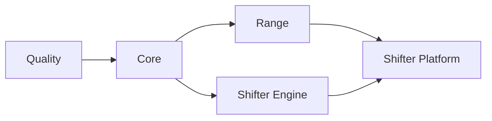

# CI/CD

GitHub Actions with self-hosted runners.

## Workflow Structure

```
.github/workflows/
├── deploy.yml              # AWS orchestrator (change detection, dependency chain)
├── _quality.yml            # Linting, security scanning
├── _core.yml               # Core infrastructure (ECR, budgets)
├── _range.yml              # Range VPC infrastructure
├── _shifter-engine.yml     # Engine container build and push
├── _shifter-platform.yml   # Portal infrastructure and app deployment
├── _gcp-dev.yml            # GCP validation/deploy workflow (still being reconciled with the Helm cutover)
├── packer.yml              # AMI builds (AWS)
└── packer-promote.yml      # AMI promotion to prod (AWS)
```

## Deployment Chain



Jobs run only when relevant files change. `deploy.yml` detects changes and triggers appropriate workflows.

## Change Detection

| Job | Triggers On |
|-----|-------------|
| **core** | `platform/terraform/modules/ecr/**`, `platform/terraform/environments/*/*.tf` |
| **range** | `platform/terraform/modules/range/**`, `platform/terraform/environments/*/range/**` |
| **shifter_engine** | `shifter/engine/provisioner/**`, `platform/terraform/modules/pulumi-provisioner/**` |
| **shifter_platform** | `platform/terraform/modules/portal/**`, `shifter/**` |

## Environment Targeting

- Push to `dev` → deploys to dev
- Push to `main` → deploys to prod
- PRs to `dev` → plan and apply to dev
- PRs to `main` → plan only (no apply)
- Manual dispatch → targets dev (safety default)

## Authentication

OIDC federation per cloud. No long-lived credentials.

| Secret | Purpose |
|--------|---------|
| `AWS_ROLE_ARN` | AWS prod IAM role |
| `AWS_ROLE_ARN_DEV` | AWS dev IAM role |
| `GCP_SERVICE_ACCOUNT` | GCP service account email |
| `GCP_WORKLOAD_IDENTITY_PROVIDER` | GCP Workload Identity Federation provider |

AWS roles defined in `platform/terraform/global/iam/github-oidc.tf`. GCP WIF configured in the GCP project.

## GCP Current State

The authoritative GCP bring-up path on this branch is the bootstrap flow:

```bash
./scripts/bootstrap/deploy.py gdc-bootstrap --project-id <project> --cluster-id <cluster>
```

That path now:

1. reconciles the GDC substrate
2. applies GCP Terraform
3. builds and pushes control-plane images
4. renders secure Helm values from Terraform outputs and Secret Manager
5. installs or upgrades the Shifter Helm release

The bootstrap path is security-gated and fails closed unless:

- `public_hostname` is set
- `enable_managed_tls = true`
- `gke_master_authorized_cidrs` is non-empty

The branch-local GitHub workflow still contains older staged GCP deployment logic and should not be treated as the authoritative GCP deploy path until it is reconciled with the Helm/bootstrap cutover.
