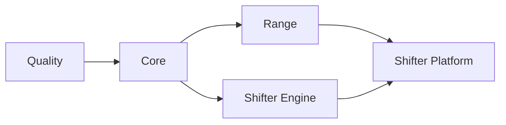

# CI/CD

GitHub Actions with self-hosted runners.

## Workflow Structure

```
.github/workflows/
├── deploy.yml              # AWS orchestrator (change detection, dependency chain)
├── _quality.yml            # Linting, security scanning
├── _core.yml               # Core infrastructure (ECR, budgets)
├── _range.yml              # Range VPC infrastructure
├── _shifter-engine.yml     # Engine container build and push
├── _shifter-platform.yml   # Portal infrastructure and app deployment
├── _gcp-dev.yml            # GCP validation/deploy workflow
├── packer.yml              # AMI builds (AWS)
└── packer-promote.yml      # AMI promotion to prod (AWS)
```

## Deployment Chain



Jobs run only when relevant files change. `deploy.yml` detects changes and triggers appropriate workflows.

## Change Detection

| Job | Triggers On |
|-----|-------------|
| **core** | `platform/terraform/modules/ecr/**`, `platform/terraform/environments/*/*.tf` |
| **range** | `platform/terraform/modules/range/**`, `platform/terraform/environments/*/range/**` |
| **shifter_engine** | `shifter/engine/provisioner/**`, `platform/terraform/modules/pulumi-provisioner/**` |
| **shifter_platform** | `platform/terraform/modules/portal/**`, `platform/terraform/modules/guacamole/**`, `platform/terraform/environments/*/portal/**` (Terraform only) |
| **portal_image** | `shifter/shifter_platform/**`, `shifter/cyberscript/**`, `shifter/installation/**` (portal image build/deploy, no Terraform) |

## Environment Targeting

- Push to `dev` → Quality only; no deploy or Terraform plan jobs
- Push to `aws-dev` → AWS dev deploy
- Push to `gcp-dev` → fast GCP validate + GCP dev deploy
- Push to `main` → code branch update only; no deploy or Terraform plan jobs
- Manual dispatch on `main` → AWS prod deploy
- PRs to `dev` → Quality only
- PRs to `aws-dev` → AWS dev plan
- PRs to `gcp-dev` → GCP validate
- PRs to `main` → Quality only

## Authentication

OIDC federation per cloud. No long-lived credentials.

| Secret | Purpose |
|--------|---------|
| `AWS_ROLE_ARN` | AWS prod IAM role |
| `AWS_ROLE_ARN_DEV` | AWS dev IAM role |
| `GCP_SERVICE_ACCOUNT` | GCP service account email |
| `GCP_WORKLOAD_IDENTITY_PROVIDER` | GCP Workload Identity Federation provider |

AWS roles defined in `platform/terraform/global/iam/github-oidc.tf`. GCP WIF configured in the GCP project.

## GCP Current State

GCP now deploys through CI/CD on `gcp-dev`. The branch model is:

- `dev`: Quality-only integration branch
- `aws-dev`: AWS dev deploy branch
- `gcp-dev`: GCP dev deploy branch

The GCP CI path:

1. validates Terraform and rendered manifests
2. applies GCP Terraform
3. builds and pushes control-plane images
4. renders secure Helm values from Terraform outputs and Secret Manager
5. installs or upgrades the Shifter Helm release

On `gcp-dev` pushes, this path now runs as a fast deploy lane. It skips the repo-wide quality workflow and relies on the provider-local validation in `_gcp-dev.yml` so break/fix iteration on GCP does not wait for the full cross-repo lint/test matrix. The full quality gate still runs on PRs and on `dev`; production deploys are manual dispatches from `main`.

The bootstrap path is security-gated and fails closed unless:

- `public_hostname` is set
- `enable_managed_tls = true`
- `gke_master_authorized_cidrs` is non-empty

`gdc-bootstrap` remains available for first-time bootstrap and controlled recovery, but it is not the normal deployment entrypoint.
