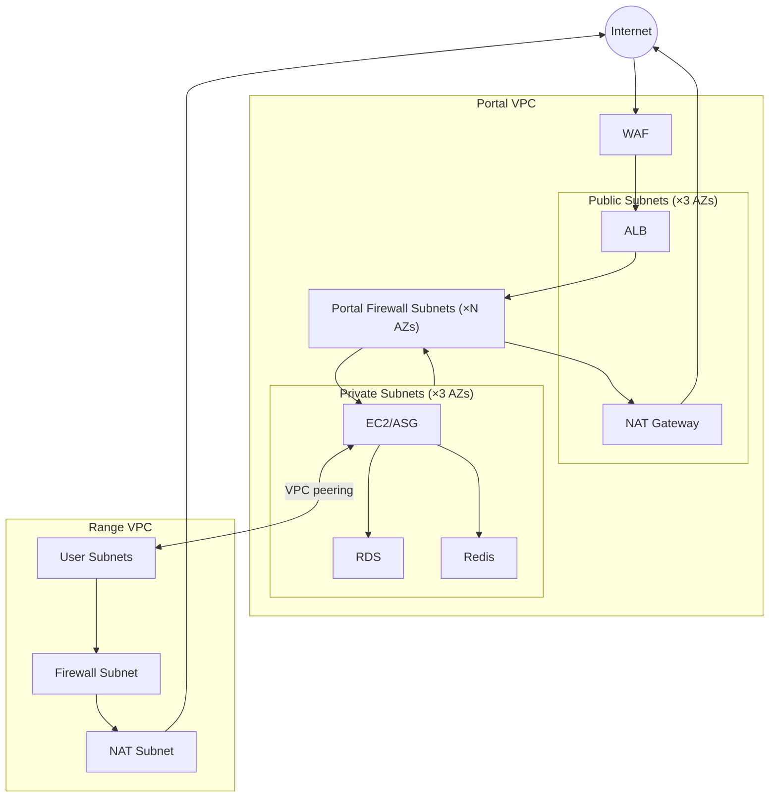

# Networking

Dual-network architecture on both clouds: a platform network for the application and a range network for guest isolation, connected via peering.

## Common Pattern

Both AWS and GCP follow the same topology:

1. **Platform network** - Hosts the application (web, database, cache, workers)
2. **Range network** - Hosts ephemeral guest instances, isolated per range
3. **Peering** - Bidirectional connectivity between platform and range networks for terminal access
4. **Egress filtering** - Domain-based outbound rules on the range network
5. **NAT** - Outbound internet for private resources

## AWS

Two VPCs per environment, connected via VPC peering.

### Portal VPC

| Subnet Type | Components |
|-------------|------------|
| Public (×3 AZs) | ALB, NAT Gateway |
| Firewall (×N AZs) | AWS Network Firewall endpoint per AZ; east-west inspection between public and private tiers |
| Private (×3 AZs) | EC2 (single instance or ASG, configurable), RDS subnet group, Redis subnet group |

Components:
- **WAF** - Rate limiting, IP reputation, OWASP rules. Attached to ALB.
- **ALB** - Public-facing. HTTPS only (HTTP redirects).
- **NAT Gateway** - Single, in one public subnet.
- **Portal Network Firewall** - East-west inspection between the public (ALB) tier and the private services tier. Stateful pass-through with baseline ALERT rules on protocols that have no legitimate east-west use (SSH/RDP/ICMP). FLOW + ALERT logs feed the existing `log-aggregation` pipeline. Gated by `enable_portal_inspection`; requires `enable_log_aggregation = true` so logs do not silently dead-end.
- **RDS** - Subnet group spans all private subnets (Multi-AZ capable). Ingress restricted to the portal EC2 / Django security group (SG-to-SG, not VPC CIDR).
- **Redis** - Subnet group spans all private subnets. Ingress restricted to the portal EC2 / Django security group (SG-to-SG, not VPC CIDR).

Defined in `platform/terraform/modules/portal/vpc/` (including `inspection.tf`) and `platform/terraform/modules/portal/alb/`.

#### Portal east-west inspection (#122)

Defense-in-depth boundary between the portal public tier and the
private services tier:

- **Mechanism**: AWS Network Firewall, the same managed primitive the
  range VPC uses for egress filtering.
- **Path**: ALB → firewall endpoint → Django EC2 (and the return path).
  The VPC has per-AZ public, private, and firewall route tables, plus
  one Network Firewall endpoint per AZ via the firewall's
  `subnet_mapping`. Each AZ's public RT keeps its IGW default and adds
  a more-specific route to every private subnet CIDR via that AZ's
  firewall endpoint; each AZ's private RT routes every public subnet
  CIDR via that AZ's firewall endpoint and redirects its 0/0 default
  through that endpoint; each AZ's firewall RT default sends onward
  Internet-bound traffic to the shared NAT gateway. The full route
  matrix ensures cross-AZ flows (created by ALB cross-zone load
  balancing and by the single shared NAT) cannot fall back to the
  implicit local VPC route and bypass inspection.
- **Stateful trade-off**: ALB always has cross-zone load balancing on
  (the platform cannot turn it off), and the portal runs a single
  shared NAT. With per-AZ firewall endpoints, cross-AZ flows are
  inspected by different endpoints on the forward and return legs
  (asymmetric stateful). This is compatible with the visibility-first
  v1 policy because rules fire per packet on whichever endpoint
  observes them and FLOW logs from both endpoints reconstruct the
  flow. A stateful drop-by-default posture would require a centralized
  inspection topology (Transit Gateway with single endpoint, GWLB
  with consistent hashing, or single-AZ appliance mode); all of those
  are deferred beyond this issue.
- **Policy**: stateful default pass with a baseline rule group that
  ALERTs on protocols that should not appear east-west (SSH, RDP,
  ICMP). FLOW logs capture every inspected flow. Visibility-first;
  nothing is dropped by default.
- **Logging**: FLOW + ALERT to a CMK-encrypted CloudWatch log group,
  subscribed through `module.log_aggregation` so the existing
  CloudWatch → Firehose → S3 / SQS pipeline carries portal-firewall
  records.
- **Fail-closed**: `enable_portal_inspection = true` requires
  `enable_log_aggregation = true`; a precondition on
  `aws_networkfirewall_firewall.portal` fails the plan otherwise.
- **Microsegmentation**: portal RDS and Redis ingress are
  SG-to-SG references from the portal EC2 / Django security group,
  not a broad `vpc_cidr` allowlist.

##### v1 deferrals

- **Stateful symmetric inspection for cross-AZ flows**: see the
  stateful trade-off above. Requires a centralized inspection topology
  (Transit Gateway with single endpoint, GWLB with consistent hashing,
  or single-AZ appliance mode).
- **Intra-private-tier inspection** (Django ↔ RDS, Django ↔ Redis):
  these services share the private subnets, so route-table-based
  inspection cannot apply (same-subnet traffic bypasses route
  lookup). v1 enforces SG-to-SG microsegmentation as the boundary for
  this traffic. A follow-up can split RDS / Redis into a dedicated
  data subnet tier so the firewall covers Django ↔ data as well.
- **Portal ↔ range peering traffic**: not in scope; the range-side
  Network Firewall already owns the range egress boundary.

### Range VPC

| Component | Purpose |
|-----------|---------|
| Firewall Subnet | AWS Network Firewall endpoint (single AZ) |
| NAT Subnet | NAT Gateway for egress |
| User Subnets | Range instances (allocated at runtime by provisioner) |

Traffic flow: `User Subnet → Network Firewall → NAT Gateway → IGW → Internet`

Network Firewall applies domain-based egress filtering. User subnets created at runtime, not by Terraform.

Defined in `platform/terraform/modules/range/vpc/`.

### VPC Peering

Bidirectional peering between Portal and Range VPCs. Enables SSH/RDP from the platform to range instances (terminal UI).

### Security Groups

| Location | Groups |
|----------|--------|
| Portal | ALB, EC2, RDS, Redis |
| Range | Defined per instance type (see Engine docs) |

Range security groups allow SSH ingress from Portal VPC CIDR for terminal access.

## GCP

Two VPC networks, connected via VPC peering.

### Platform Network

Hosts the GKE cluster and shared services.

| Component | Connectivity |
|-----------|-------------|
| GKE nodes | Private (no external IPs). Cloud NAT for outbound. |
| GKE control plane | Public endpoint retained for bootstrap compatibility, restricted by authorized CIDRs. |
| Cloud SQL | Private Services Access (internal IP only) |
| Memorystore | Private VPC connection |

GKE uses VPC-native networking with secondary IP ranges for pods and services. The current GCP bootstrap path keeps the control-plane endpoint public so the operator can run `get-credentials` and Helm locally, but that endpoint must be restricted with `gke_master_authorized_cidrs`.

The public application edge is separate from operator access:

- portal and Guacamole are exposed through GKE Ingress on a reserved global IP
- Cloud Armor attaches to both public backends through `BackendConfig`
- managed TLS is required for the intended `gcp-dev` posture
- GDC workstation and cluster hosts are private-only and reached over IAP instead of public SSH

### Range Network

Hosts guest subnets for range instances. Cloud Router + NAT for egress.

On GDC, guest isolation uses custom L2 networks (VXLAN-based) with per-range Kubernetes namespaces and Network Attachment Definitions instead of VPC subnets. See [GDC Provisioning](gdc-provisioning).

### Network Peering

Bidirectional peering between platform and range networks for terminal access, same pattern as AWS.

## CIDRs

Both clouds use configurable CIDR ranges defined in environment tfvars. The specific allocations are deployment config, not architecture.

## Related Docs

- [GCP Infrastructure](gcp-infrastructure) - GKE cluster and platform services
- [GDC Provisioning](gdc-provisioning) - GDC guest networking details
- [Guacamole](guacamole) - Browser-based terminal access (uses the peering connection)
