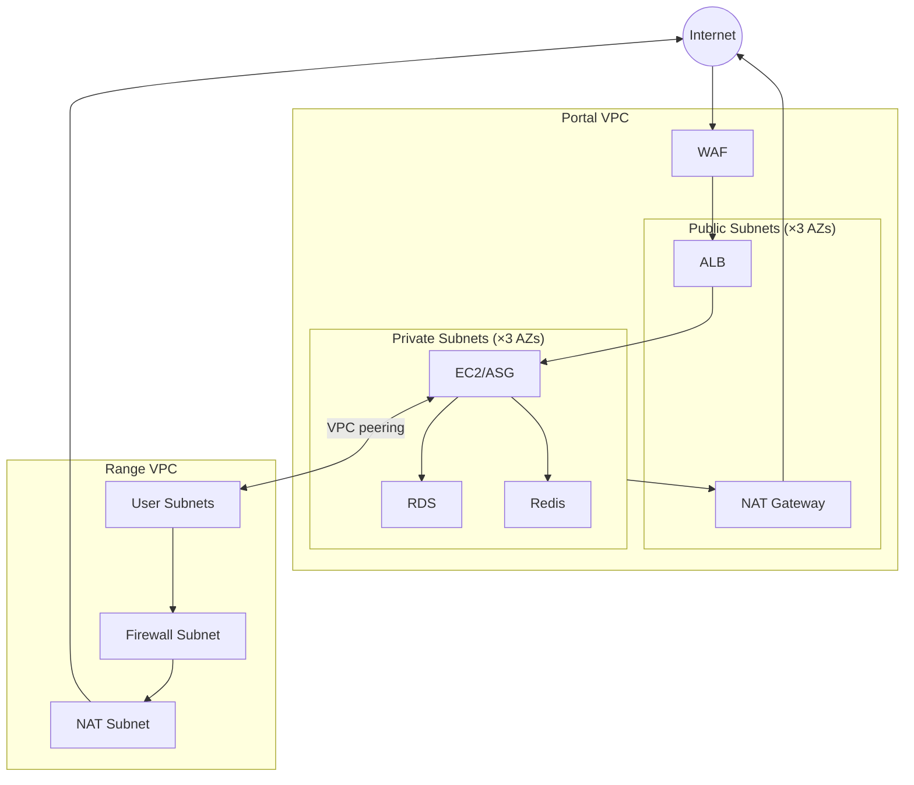

# Networking

Dual-network architecture on both clouds: a platform network for the application and a range network for guest isolation, connected via peering.

## Common Pattern

Both AWS and GCP follow the same topology:

1. **Platform network** - Hosts the application (web, database, cache, workers)
2. **Range network** - Hosts ephemeral guest instances, isolated per range
3. **Peering** - Bidirectional connectivity between platform and range networks for terminal access
4. **Egress filtering** - Domain-based outbound rules on the range network
5. **NAT** - Outbound internet for private resources

## AWS

Two VPCs per environment, connected via VPC peering.

### Portal VPC

| Subnet Type | Components |
|-------------|------------|
| Public (×3 AZs) | ALB, NAT Gateway |
| Private (×3 AZs) | EC2 (single instance or ASG, configurable), RDS subnet group, Redis subnet group |

Components:
- **WAF** - Rate limiting, IP reputation, OWASP rules. Attached to ALB.
- **ALB** - Public-facing. HTTPS only (HTTP redirects).
- **NAT Gateway** - Single, in one public subnet.
- **RDS** - Subnet group spans all private subnets (Multi-AZ capable).
- **Redis** - Subnet group spans all private subnets.

Defined in `platform/terraform/modules/portal/vpc/` and `platform/terraform/modules/portal/alb/`.

### Range VPC

| Component | Purpose |
|-----------|---------|
| Firewall Subnet | AWS Network Firewall endpoint (single AZ) |
| NAT Subnet | NAT Gateway for egress |
| User Subnets | Range instances (allocated at runtime by provisioner) |

Traffic flow: `User Subnet → Network Firewall → NAT Gateway → IGW → Internet`

Network Firewall applies domain-based egress filtering. User subnets created at runtime, not by Terraform.

Defined in `platform/terraform/modules/range/vpc/`.

### VPC Peering

Bidirectional peering between Portal and Range VPCs. Enables SSH/RDP from the platform to range instances (terminal UI).

### Security Groups

| Location | Groups |
|----------|--------|
| Portal | ALB, EC2, RDS, Redis |
| Range | Defined per instance type (see Engine docs) |

Range security groups allow SSH ingress from Portal VPC CIDR for terminal access.

## GCP

Two VPC networks, connected via VPC peering.

### Platform Network

Hosts the GKE cluster and shared services.

| Component | Connectivity |
|-----------|-------------|
| GKE nodes | Private (no external IPs). Cloud NAT for outbound. |
| Cloud SQL | Private Services Access (internal IP only) |
| Memorystore | Private VPC connection |

GKE uses VPC-native networking with secondary IP ranges for pods and services. Control plane endpoint is private.

### Range Network

Hosts guest subnets for range instances. Cloud Router + NAT for egress.

On GDC, guest isolation uses custom L2 networks (VXLAN-based) with per-range Kubernetes namespaces and Network Attachment Definitions instead of VPC subnets. See [GDC Provisioning](gdc-provisioning).

### Network Peering

Bidirectional peering between platform and range networks for terminal access, same pattern as AWS.

## CIDRs

Both clouds use configurable CIDR ranges defined in environment tfvars. The specific allocations are deployment config, not architecture.

## Related Docs

- [GCP Infrastructure](gcp-infrastructure) - GKE cluster and platform services
- [GDC Provisioning](gdc-provisioning) - GDC guest networking details
- [Guacamole](guacamole) - Browser-based terminal access (uses the peering connection)
