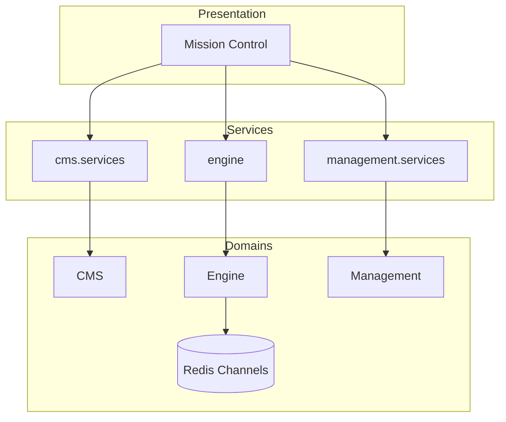
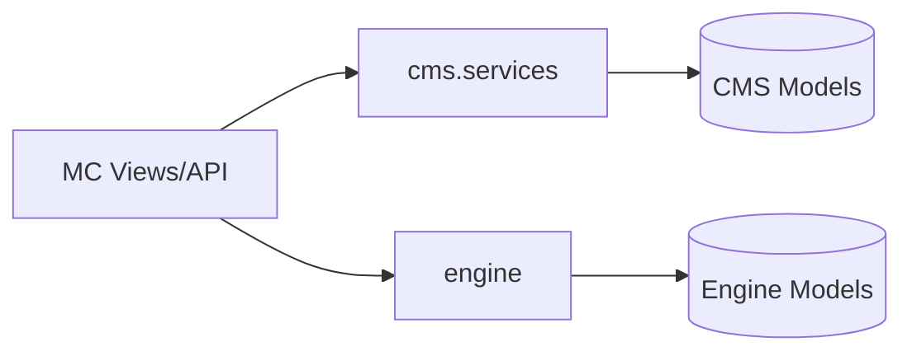
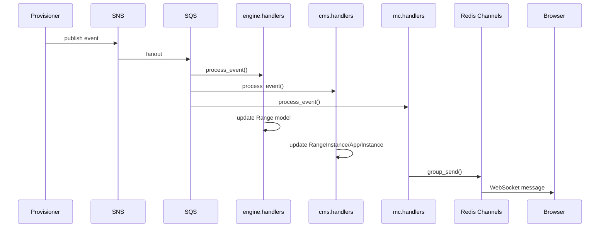

# Shifter Platform

Django application architecture for the Shifter cyber range platform.

## Domains

Four bounded contexts, each a Django app with distinct responsibilities.



| Domain | App | Responsibility |
|--------|-----|----------------|
| **Mission Control** | `mission_control` | Presentation layer. DRF API, Django views, WebSocket consumers. |
| **Shifter Engine** | `engine` | Infrastructure lifecycle. Range provisioning, NGFW operations. |
| **Shifter CMS** | `cms` | User content. Assets, credentials, scenario catalog. |
| **Shifter Management** | `management` | Platform administration. Audit logging, user management. |

## Model Ownership

| Domain | Models |
|--------|--------|
| **CMS** | `Credential`, `CredentialType`, `AgentConfig`, `OperatingSystem`, `Instance`, `App`, `Subnet`, `InstanceType`, `AppType`, `Request`, `RangeInstance` |
| **Engine** | `Request`, `Range`, `Instance`, `App`, `Subnet` |
| **Management** | `UserProfile`, `ActivityLog` |

Both CMS and Engine have Instance/App/Subnet models serving different purposes:
- **CMS**: Asset definitions (types, catalog entries) and user content tracking
- **Engine**: Infrastructure instantiations with Pulumi/Terraform state

## Service Layer

Domains expose Python service interfaces. No HTTP between apps.



Mission Control imports and calls domain services:

```python
from cms.services import create_agent, get_storage_used
from engine import launch_range, destroy_range
```

Services own business logic. Views handle HTTP concerns only.

## Status Updates

Provisioner publishes status events to SNS. Events fan out to SQS where domain handlers process them:



Each domain's handler (in `{app}/handlers.py`) processes the same event differently:
- **Engine**: Updates `Range` status, timestamps (`ready_at`, `destroyed_at`)
- **CMS**: Updates `RangeInstance`, `Instance`, `App` status
- **Mission Control**: Broadcasts to WebSocket groups for real-time UI

Channel groups:
- `range_events_{request_id}` - range lifecycle updates
- `ngfw_events_{app_id}` - NGFW lifecycle updates

## Domain Relationships

CMS defines *what* users can build. Engine defines *how* it runs.

```
CMS::AgentConfig ──referenced by──▶ Engine::Range
CMS::SCMCredential ──referenced by──▶ Engine::UserNGFW
CMS::NGFWDeploymentProfile ──referenced by──▶ Engine::UserNGFW
```

Foreign keys across domains are allowed. Referential integrity via database. Business logic via service calls.

## Design Decisions

| Decision | Choice | Rationale |
|----------|--------|-----------|
| Inter-domain communication | Python service calls | Same process, no serialization overhead. HTTP only at edge. |
| Cross-domain foreign keys | Allowed | Pragmatic Django. DB integrity without microservices complexity. |
| Status delivery | Redis pub/sub | Eliminates DB polling. Real-time updates to browser. |
| API location | Mission Control only | Single HTTP surface. Domains expose services, not endpoints. |
