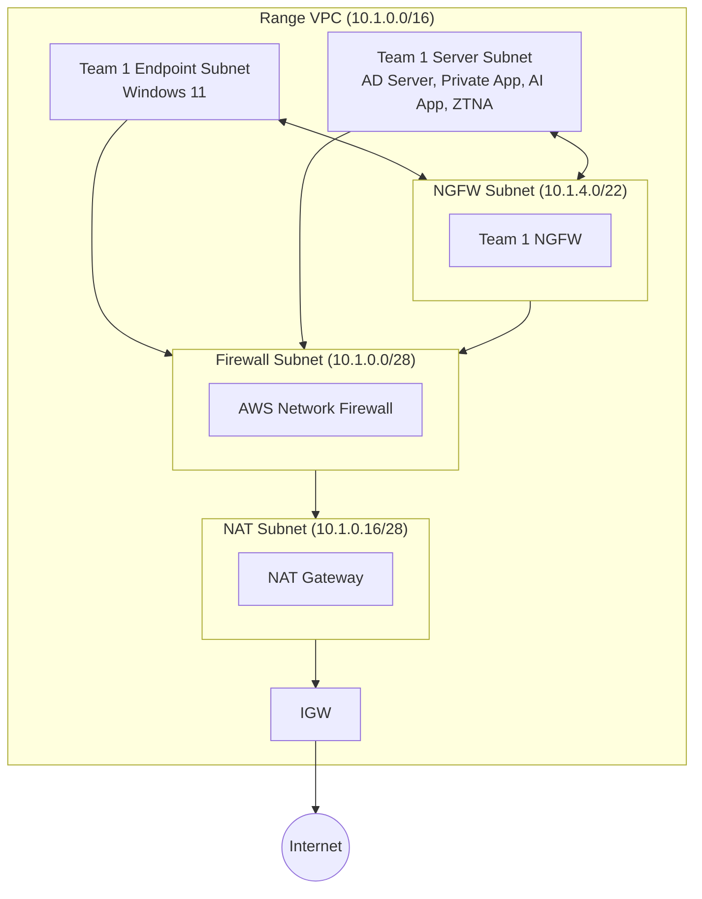

# Shifter Range VPC Architecture

## Route Tables

### Per User Subnet (own route table)

| Destination | Target | Purpose |
|---|---|---|
| Own subnet CIDR | local | Intra-subnet |
| Other team subnet CIDRs | Team's NGFW dataplane ENI | Inter-subnet (PAN-OS inspects) |
| Portal VPC CIDR | VPC peering | SSH/RDP from Guacamole (bypasses NGFW) |
| 0.0.0.0/0 | AWS Network FW endpoint | Egress filtering |
| S3 | Gateway endpoint | Agent downloads |

### NGFW Subnet (shared private route table)

| Destination | Target | Purpose |
|---|---|---|
| 0.0.0.0/0 | AWS Network FW endpoint | All NGFW egress — bypass rule passes unfiltered |

## NGFW Config (PAN-OS via SSH)

- ethernet1/1 = dataplane ENI, Layer 3 DHCP, 'ranges' zone
- Static routes per subnet via ethernet1/1 to VPC gateway
- Security rules per connected subnet pair (bidirectional, allow, alert-only profiles)
- XDR log forwarding on all rules
